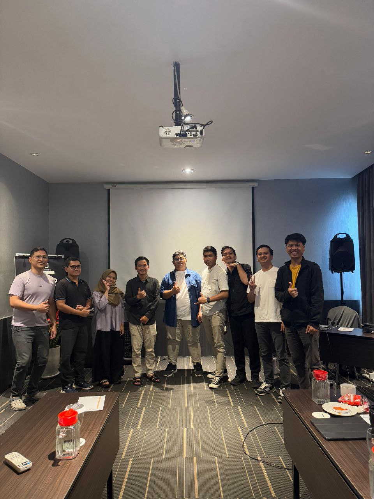

# 🚀 SecureFrontend — Workshop Secure Coding Frontend

<p align="center">
  
</p>

<p align="center">
  <b>Frontend aplikasi imigrasi untuk latihan secure coding.</b><br>
  <i>Dibuat dengan Vue 3, Vite, dan TailwindCSS.</i>
</p>

<p align="center">
  <a href="https://github.com/ArfHbb/SecureFrontend"></a>
  
  
  
</p>

---

## ✨ Fitur Utama

- Login Petugas Imigrasi (dengan proteksi brute force dan session timeout)
- Dashboard verifikasi kedatangan
- Detail kedatangan, approve/reject
- Restriksi device (hanya desktop/iPad)
- UI modern dan responsif
- Error & loading handled dengan SweetAlert2

---

## 📦 Prasyarat

- Node.js >= 18
- NPM >= 8

---

## 🚀 Cara Install & Jalankan

### 1. Clone Repository

```bash
git clone https://github.com/ArfHbb/SecureFrontend.git
cd SecureFrontend
```

### 2. Install Dependencies

```bash
npm install
```

### 3. Jalankan Development Server

```bash
npm run dev
```

Akses aplikasi di: [http://localhost:5173](http://localhost:5173)

### 4. Build untuk Production

```bash
npm run build
```

---


## 🛡️ Catatan Workshop

- Aplikasi ini dibuat **hanya untuk tujuan pembelajaran** dan **tidak boleh** digunakan di lingkungan produksi.
- Dalam workshop, peserta akan **menganalisis, menemukan, dan memperbaiki kelemahan** yang ada pada aplikasi ini.

---


## 📝 Laporan Bug Hunt & Bug Fixing

- Laporan hasil bug hunt dan perbaikan keamanan dapat diakses pada file berikut:
  [`files/Bug Hunt (1).docx`](./files/Bug%20Hunt%20(1).docx)

- Dokumen ini berisi daftar temuan bug, penjelasan, dan solusi yang diterapkan untuk membuat sistem lebih secure.

---


## 📸 Demo & Dokumentasi Pelatihan


<p align="center">
  
  <br>
  <i>Foto suasana pelatihan secure coding frontend</i>
</p>

---

## 📚 Materi Pelatihan (PDF)

- [`files/BSSN Workshop - FE Secure Coding.pdf`](./files/BSSN%20Workshop%20-%20FE%20Secure%20Coding.pdf)
- [`files/BSSN Workshop - Secure By Design - Day 1.pdf`](./files/BSSN%20Workshop%20-%20Secure%20By%20Design%20-%20Day%201.pdf)
- [`files/BSSN Workshop - Secure By Design - Day 2.pdf`](./files/BSSN%20Workshop%20-%20Secure%20By%20Design%20-%20Day%202.pdf)

## 📄 Lisensi

Hak cipta © 2025 — Digunakan hanya untuk kepentingan workshop internal.
